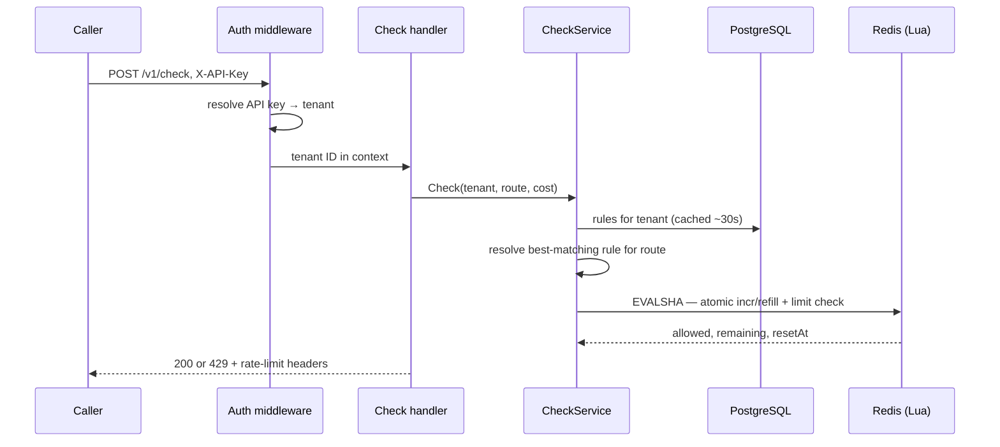

# Distributed Rate Limiter

Multi-tenant rate limiting service in Go. Services call `POST /v1/check` with an API key and a route, and get back an allow/deny decision. Rules are configured per tenant in PostgreSQL; the actual counting happens atomically in Redis via Lua scripts.

It's advisory, not a proxy — the caller enforces the decision. `examples/gateway-middleware` shows a proxy that does enforce it in front of upstream traffic.

## Architecture

```
                 POST /v1/check
Caller  ───────────────────────────►  Rate Limiter API
        ◄───────────────────────────  200 {allowed:true,...} / 429
                                              │
                                ┌─────────────┴─────────────┐
                                │                            │
                          PostgreSQL                      Redis
                    tenants, API keys, rules          Lua scripts, atomic
                       (read via cache)                 incr/refill/check
```

Postgres holds config that changes rarely (tenants, keys, rules). Redis holds counters that change on every request — the increment-and-check has to be atomic or two concurrent requests can both squeeze through the last slot, so it's done in Lua, server-side, in one round trip.

## Request flow



Rule resolution: exact route match > longest prefix match > tenant default (`*`) > no match = allow. Rate limiting is opt-in per rule, not a global default.

## Algorithms

- **Token bucket** — capacity + refill rate, allows bursts up to capacity. Used for payments.
- **Sliding window** — rolling time window, no burst at window boundaries. Used for orders and the tenant default.

Both live as Lua scripts in `internal/infrastructure/redis/scripts/`.

## Layout

Clean Architecture — domain has zero dependency on HTTP/Redis/Postgres; infra implements the ports domain/application define.

```
cmd/server/               composition root, starts the HTTP server
cmd/migrate/              migration runner

internal/domain/          entities (Tenant, Rule, Decision) + port interfaces
internal/application/     AuthService, CheckService, RuleResolver
internal/infrastructure/  Redis limiter, Postgres repos, rule cache
internal/transport/http/  routes, auth/logging/metrics middleware
internal/observability/   slog + Prometheus

examples/
  payment-service/        calls /v1/check directly (advisory)
  order-service/          calls /v1/check directly (advisory)
  gateway-middleware/     proxies and enforces the decision (gateway mode)

test/unit/                no external deps
test/integration/         real Postgres/Redis via testcontainers
test/concurrency/         race/stress tests (-race)
load/k6/                  load tests against a running stack

migrations/                schema + demo seed data
docs/                       architecture, ADRs, learning notes
```

Call path: `transport/http` → `application` (orchestration) → `domain` (pure rules, no I/O) → `infrastructure` (Postgres/Redis implementations).

## Quick start

Requires Docker, Docker Compose, Make.

```bash
git clone https://github.com/saurabhm02/go-rate-limiter.git
cd go-rate-limiter

make docker-up    # postgres, redis, prometheus, API
make migrate      # schema + demo seed

curl http://localhost:8080/health/live
curl http://localhost:8080/health/ready

curl -s -X POST http://localhost:8080/v1/check \
  -H "X-API-Key: rl_demo_abc123xyz" \
  -H "Content-Type: application/json" \
  -d '{"route":"/api/payments/1","cost":1}'

make examples-up
curl -X POST http://localhost:8081/api/payments/pay-1   # advisory
curl -X POST http://localhost:8083/api/payments/pay-2   # via gateway
```

Demo API key: `rl_demo_abc123xyz` (tenant `demo-corp`).

## API

| Endpoint | Auth | Description |
|----------|------|-------------|
| `POST /v1/check` | API key | Rate limit check |
| `GET /v1/config/tenants` | API key | List tenants |
| `GET /v1/config/tenants/{id}/rules` | API key | List tenant rules |
| `GET /health/live` | none | Liveness |
| `GET /health/ready` | none | Postgres + Redis readiness |
| `GET /metrics` | none | Prometheus |

Config API is read-only by design — tenants/rules/keys are managed through SQL migrations/seeds, not a write API (`docs/adr/006-read-only-config-api.md`). Full contract in [docs/api/openapi.yaml](docs/api/openapi.yaml).

## Configuration

| Variable | Default | Description |
|----------|---------|-------------|
| `HTTP_PORT` | `8080` | Listen port |
| `DATABASE_URL` | local postgres | PostgreSQL DSN |
| `REDIS_URL` | `redis://localhost:6379/0` | Redis address |
| `LOG_LEVEL` | `info` | debug/info/warn/error |
| `RULE_CACHE_TTL` | `30s` | In-process rule cache TTL |
| `SHUTDOWN_TIMEOUT` | `10s` | Graceful shutdown timeout |

## Demo seed rules (`demo-corp`)

| Route pattern | Algorithm | Limit |
|---------------|-----------|-------|
| `/v1/check` | Sliding window | 100/min |
| `/api/payments*` | Token bucket | 10 capacity, 2/sec refill |
| `/api/orders*` | Sliding window | 50/min |
| `*` | Sliding window | 1000/hour |

## Development

```bash
make test              # unit + concurrency
make test-integration  # testcontainers, requires Docker
make test-all          # full pyramid
make lint              # go vet
make build             # bin/server
make loadtest          # k6, stack must be up
```

```
k6            load/k6/           realistic load against a running stack
concurrency   test/concurrency/  race conditions under load (-race)
integration   test/integration/  real Postgres + Redis (testcontainers)
unit          test/unit/         no external services
```

Go 1.25+ for local `make run` / `make migrate`.

## Docs

- [docs/architecture.md](docs/architecture.md) — deeper system design
- [CONTEXT.md](CONTEXT.md) — domain glossary
- [docs/api/openapi.yaml](docs/api/openapi.yaml) — REST contract
- [docs/adr/](docs/adr/) — architecture decision records

