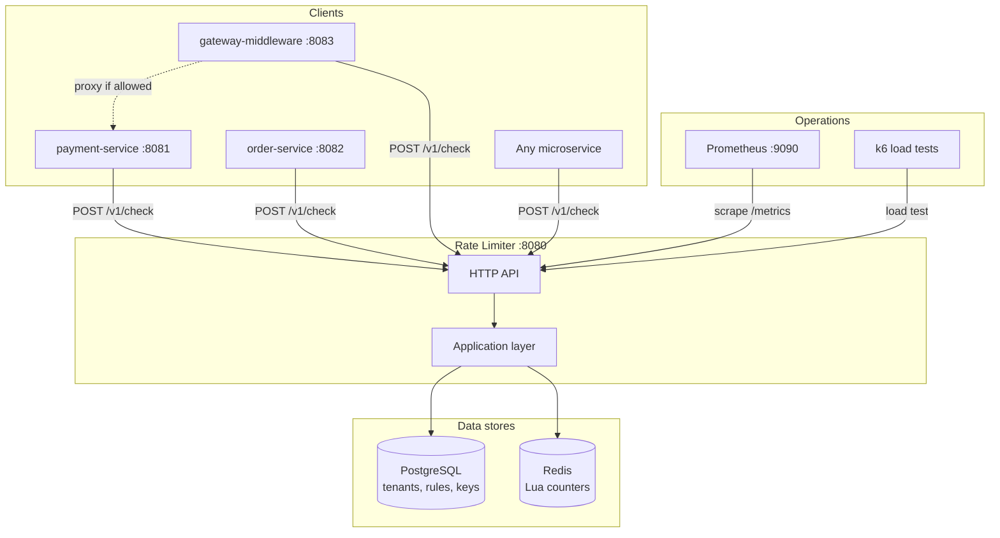
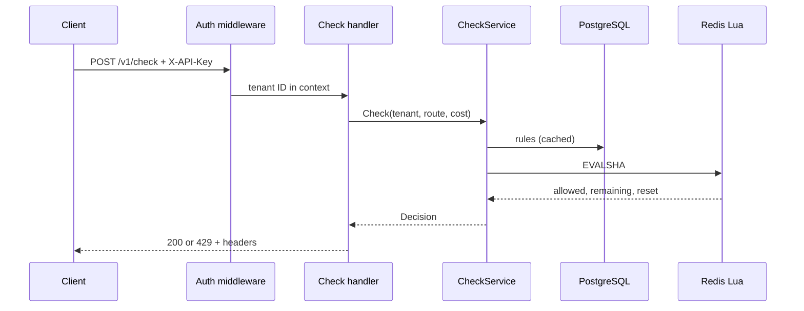

# Architecture

Distributed Rate Limiter — production core with example integrations in `examples/`.

## System context



## Request flow (check)



## Clean Architecture layers

| Layer | Path | Responsibility |
|-------|------|----------------|
| Entry | `cmd/server/`, `cmd/migrate/` | Wiring, lifecycle |
| Transport | `internal/transport/http/` | Routes, auth, logging, metrics |
| Observability | `internal/observability/` | slog + Prometheus |
| Application | `internal/application/` | Auth, check, rule resolution |
| Domain | `internal/domain/` | Entities, ports, errors |
| Infrastructure | `internal/infrastructure/` | Redis, Postgres, cache |

Dependency rule: **domain has no outward dependencies**. Infrastructure implements ports.

## Core API surface

| Endpoint | Auth | Purpose |
|----------|------|---------|
| `POST /v1/check` | Yes | Advisory rate limit check |
| `GET /v1/config/tenants` | Yes | List tenants (read-only) |
| `GET /v1/config/tenants/{id}/rules` | Yes | List rules (read-only) |
| `GET /health/live` | No | Liveness |
| `GET /health/ready` | No | PG + Redis readiness |
| `GET /metrics` | No | Prometheus scrape |

## Algorithms

| Algorithm | Use case | Redis keys |
|-----------|----------|------------|
| Token bucket | Burst traffic (payments) | Single key per tenant+route hash |
| Sliding window | Smooth rate (orders, defaults) | curr + prev + index keys |

## Testing strategy

```
        ┌─────────┐
        │  k6     │  load/k6/
        ├─────────┤
        │ Concurr │  test/concurrency/ (-race)
        ├─────────┤
        │ Integr. │  test/integration/ (testcontainers)
        ├─────────┤
        │  Unit   │  test/unit/
        └─────────┘
```

## Deployment

| Profile | Command | Notes |
|---------|---------|-------|
| Development | `make docker-up` | Exposes PG/Redis ports |
| Production | `make docker-prod-up` | Internal DB/Redis, migrate job |
| Examples | `make examples-up` | Full demo stack |

## ADRs

Architecture decisions: [docs/adr/](adr/)

## Related docs

- [CONTEXT.md](../CONTEXT.md) — domain glossary
- [docs/api/openapi.yaml](api/openapi.yaml) — REST contract
- [docs/interview-guide.md](interview-guide.md) — interview prep
